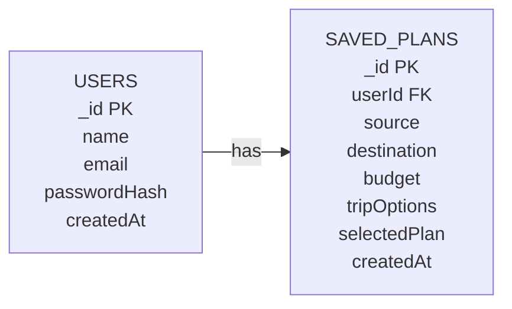

```mermaid
flowchart LR
    USERS["USERS
    _id PK
    name
    email
    passwordHash
    createdAt"] -->|has| SAVED_PLANS["SAVED_PLANS
    _id PK
    userId FK
    source
    destination
    budget
    tripOptions
    selectedPlan
    createdAt"]

```
