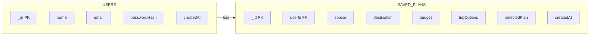

```mermaid
flowchart LR
    subgraph USERS_Table [USERS]
        _id["_id PK"]
        name["name"]
        email["email"]
        passwordHash["passwordHash"]
        createdAt["createdAt"]
    end

    subgraph SAVED_PLANS_Table [SAVED_PLANS]
        sp_id["_id PK"]
        userId["userId FK"]
        source["source"]
        destination["destination"]
        budget["budget"]
        tripOptions["tripOptions"]
        selectedPlan["selectedPlan"]
        sp_createdAt["createdAt"]
    end

    USERS_Table -->|has| SAVED_PLANS_Table


```
